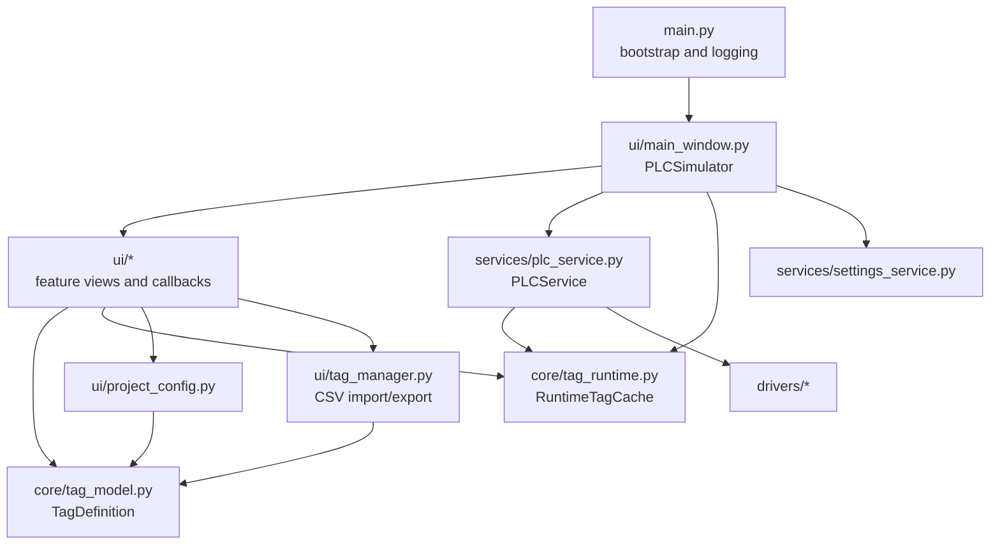
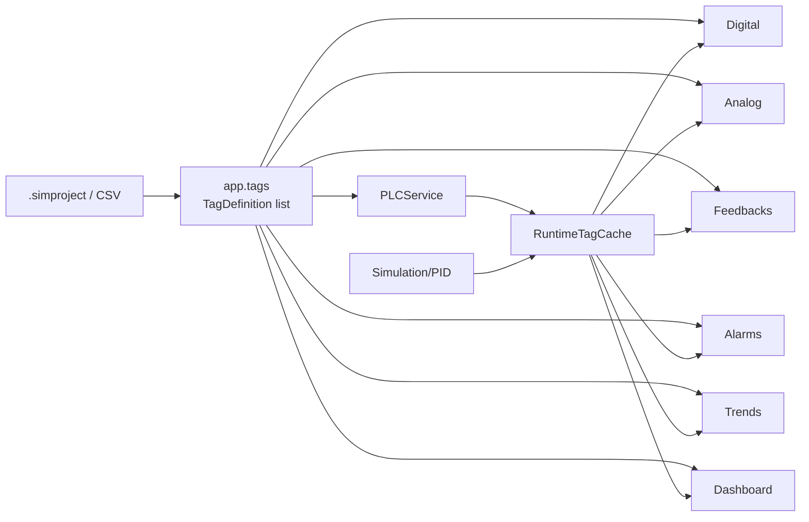
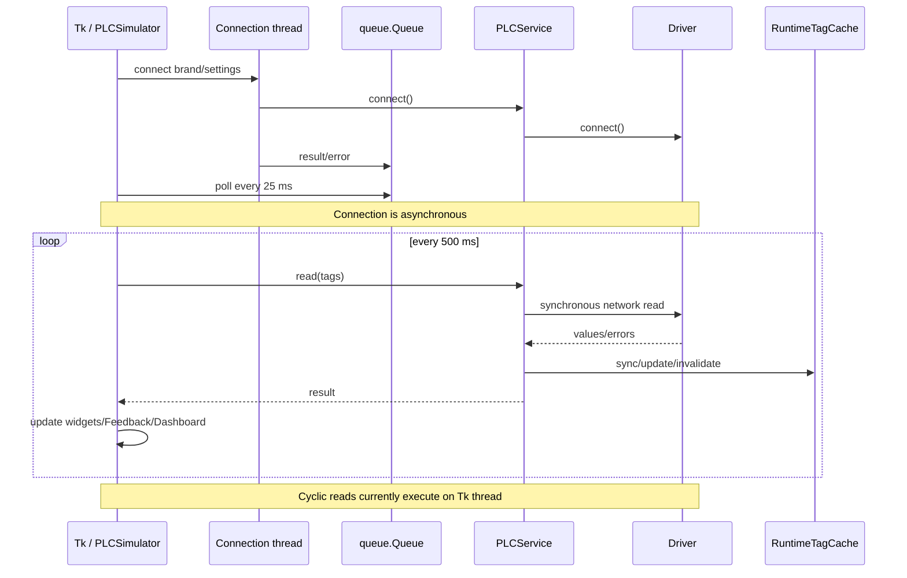
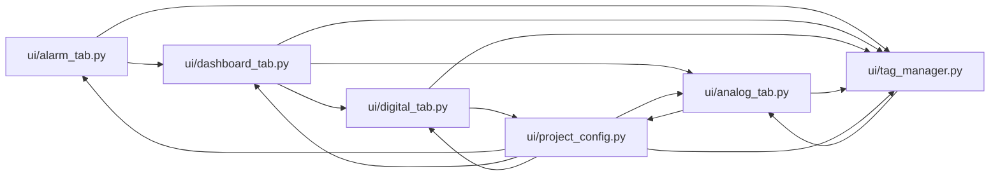
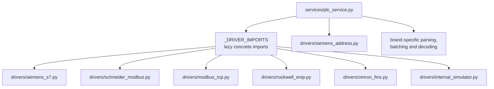
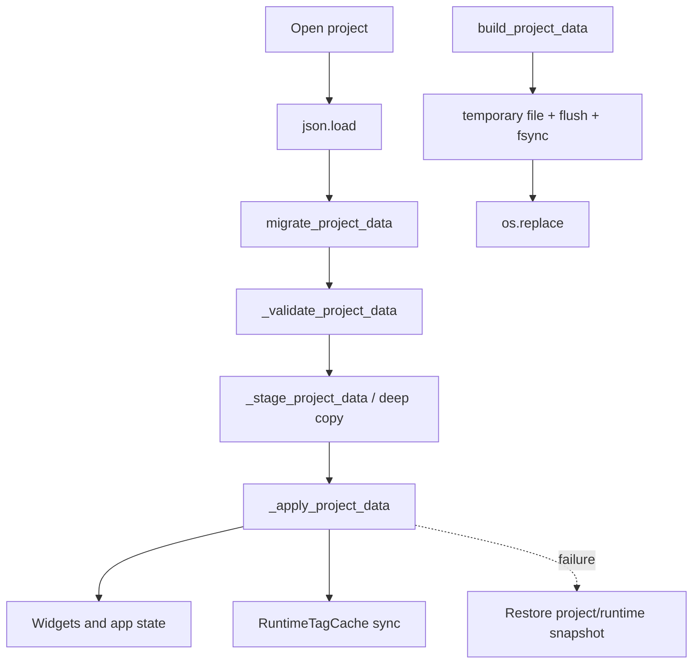
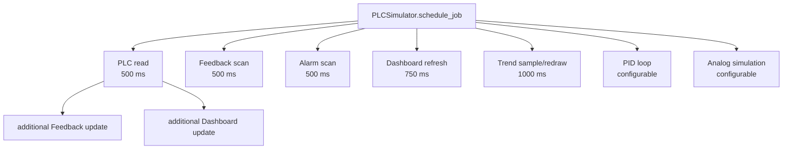
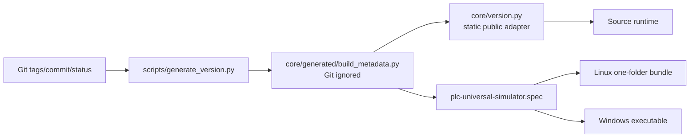
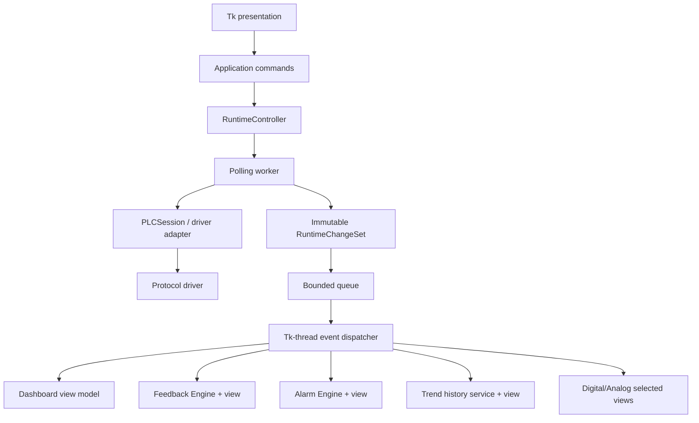
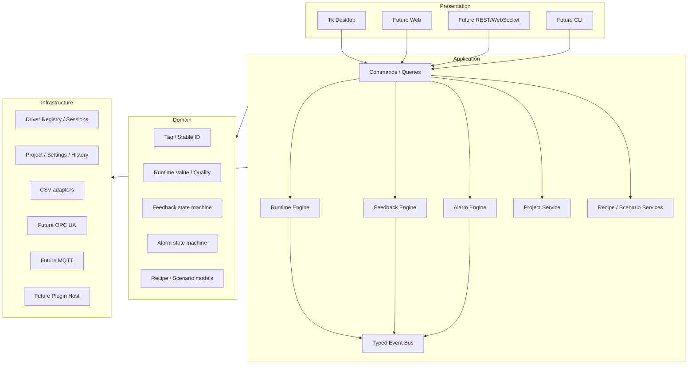

# PLC Universal Simulator — Architecture and Dependency Graphs

## Purpose

This document visualizes the current architecture, runtime flows, dependency cycle, persistence, build path, and recommended target boundaries. Paths in nodes refer to repository modules.

## Current high-level architecture

## Current feature data flow

## Current PLC connection and polling flow

## Internal module dependency cycle

The six nodes above form one strongly connected component. Some edges use local imports, which defer rather than eliminate the cycle.

## PLC driver routing

## Persistence flow

## Current callback topology

## Build and version flow

## Recommended near-term runtime architecture

## Recommended target architecture

## Boundary rules for future work

1. Domain modules must not import Tk or protocol libraries.
2. Presentation must not access concrete drivers.
3. Driver adapters must publish typed results rather than mutate widgets.
4. Project/CSV parsing must be callable without constructing `PLCSimulator`.
5. Workers must never update Tk widgets.
6. Feature engines must use stable tag IDs and explicit quality.
7. Plugins must depend on published application ports, not dynamic `app` attributes.
