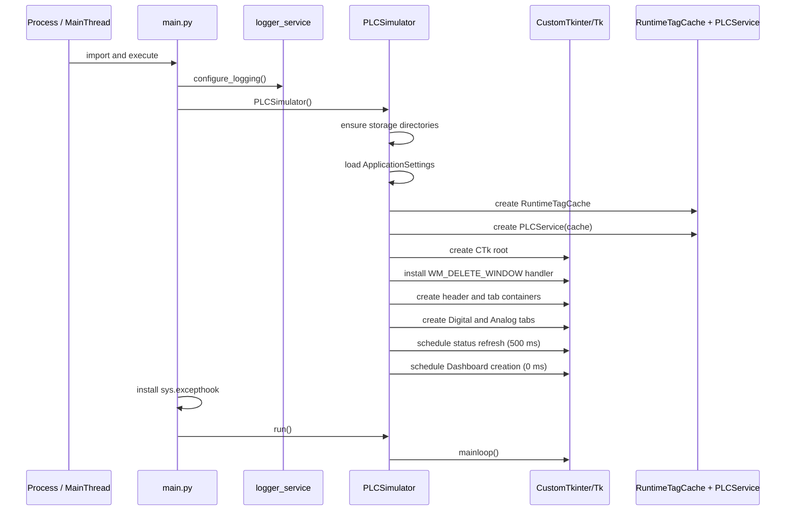
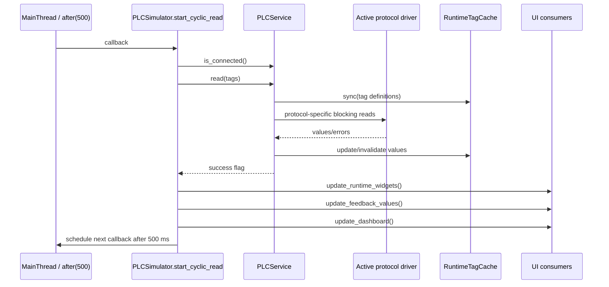
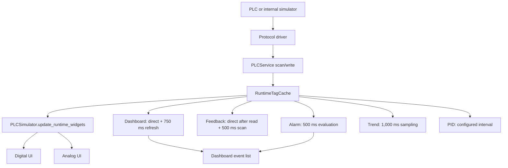

# PLC Universal Simulator — Current Runtime Threading Model

## Status and scope

This document is the authoritative baseline for the threading model implemented
at the time of Engineering Infrastructure Phase 1C. It describes current code;
it does not describe a target architecture.

Evidence was taken from `main.py`, `ui/main_window.py`, `services/plc_service.py`,
the protocol drivers, `core/tag_runtime.py`, and the Dashboard, Alarm, Feedback,
Trend, PID, Digital and Analog modules. No `services/connection_service.py`,
`ThreadPoolExecutor`, `asyncio` runtime, or PLC polling worker exists in the
repository.

Line references identify the reviewed implementation and can move as unrelated
files evolve.

## 1. Overview

The application is a Tk desktop process. The Python process begins on
`MainThread`; the CustomTkinter root and `mainloop()` remain on that thread. Most
application work—including project and CSV operations, PLC reads and writes,
runtime-cache mutation, simulation, PID, alarms, feedbacks, trends and widget
refresh—is invoked by Tk events or Tk `after()` callbacks on `MainThread`.

Two explicit background-thread roles exist:

1. `plc-connect`, a daemon thread created for each connection attempt;
2. `shutdown-watchdog`, a daemon thread created when shutdown begins.

Only the connection thread uses `queue.Queue`: it places a connection result in
a queue that Tk polls every 25 ms. There is no queue between PLC reads and the
runtime cache. The 500 ms PLC read callback calls `PLCService.read()` directly
from Tk.

The central callback wrapper is `PLCSimulator.schedule_job()` at
`ui/main_window.py:214`. It calls `self.app.after()`, records the job identifier
in `_pending_jobs`, removes it immediately before execution, and suppresses the
callback after shutdown starts.

## 2. Application startup

### 2.1 Sequence



`main.py:10` configures logging before importing `PLCSimulator`. In its guarded
executable block, it installs the process exception hook, logs startup, creates
the simulator, records startup metrics and enters `mainloop()`.

`PLCSimulator.__init__()` (`ui/main_window.py:142`) performs the following on
`MainThread`:

- prepares storage directories and loads settings;
- constructs `RuntimeTagCache` and `PLCService`;
- initializes shared lists, dictionaries and lifecycle flags;
- creates the Tk root and exception callback;
- constructs the header and tab containers;
- eagerly creates Digital and Analog tab structures;
- restores connection fields and recent-project UI;
- schedules lazy Dashboard construction with a zero-delay job.

No PLC connection is initiated automatically by this startup path. No explicit
application background thread is started during ordinary startup. Protocol
libraries may manage internal native resources after use; library-created
threads were **not confirmed** by repository code.

`main.py:_configure_shutdown_integration()` contains opt-in test/integration
callbacks controlled by environment variables. They are not part of normal
startup.

## 3. Tk Main Thread

Tk owns and invokes the following responsibilities on `MainThread`:

| Responsibility | Current implementation evidence |
|---|---|
| Root/window lifecycle | `PLCSimulator.__init__()`, `run()`, `on_close()` |
| Widget creation and mutation | All modules under `ui/` |
| Menus, keyboard/mouse callbacks and dialogs | Tk command/bind callbacks and `messagebox`/`filedialog` calls |
| Project create/open/save/migration/application | `ui/project_config.py`, called from UI callbacks |
| CSV selection, parsing and import application | `ui/tag_manager.py`, called from UI callbacks |
| Settings load/save and recent projects | initialization, `_save_settings()`, project lifecycle methods |
| PLC connection result handling | `_poll_connection_result()` via `after(25)` |
| PLC read cycle | `start_cyclic_read()` calls `PLCService.read()` directly |
| PLC writes and read-back | Digital, Analog and PID UI callbacks call `PLCService.write_*()` directly |
| Runtime cache updates from reads/writes | `PLCService` mutates the shared `RuntimeTagCache` on its caller thread |
| Digital and Analog table updates | `update_runtime_widgets()` and incremental/lazy refresh callbacks |
| Dashboard refresh | direct update calls plus 750 ms scheduler |
| Feedback scan | 500 ms scheduler plus direct update after each PLC cycle |
| Alarm evaluation | 500 ms scheduler |
| Trend sampling/rendering | 1,000 ms scheduler and Matplotlib Tk canvas |
| PID calculation/write | configured interval, minimum 100 ms |
| Analog profile simulation/write | one 50 ms scheduler while profiles are active |
| Shutdown orchestration | `on_close()` executes phases synchronously on Tk |

Tk callbacks are serialized by `mainloop()`: a callback must return before Tk
can process the next event. Consequently, a blocking file, driver or rendering
operation delays all other Tk work.

## 4. Background threads

### 4.1 Confirmed thread inventory

| Name | Owner | Purpose | Starts | Stops | Touches UI | Uses `after()` | Uses Queue | Notes |
|---|---|---|---|---|---|---|---|---|
| `MainThread` | Process/Tk | Runs startup, `mainloop()`, callbacks, polling, UI and shutdown | Process entry | Process exit | Yes | Yes | Reads connection queue | Not a background thread, included for completeness. |
| `plc-connect` | `PLCSimulator.connect()` | Calls `PLCService.connect()` without blocking Tk | Each Connect action | When `connect()` returns or raises | No direct widget access | No; Tk separately polls result | Yes, writes one tuple | Daemon; a new thread and queue are created per attempt. |
| `shutdown-watchdog` | `PLCSimulator.on_close()` | Waits five seconds, then logs phase/thread diagnostics and dumps tracebacks | First accepted close attempt | `_shutdown_complete_event` is set, or after diagnostic work | No widget mutation | No | No | Daemon; diagnostic only, does not cancel/kill shutdown. |

**Confirmed application thread roles: 3**, including `MainThread`; **2** are
explicit background-thread roles.

### 4.2 Connection thread

`PLCSimulator.connect()` (`ui/main_window.py:378-404`) captures brand, address
and options on Tk, increments `_connection_generation`, creates a fresh
`queue.Queue`, and starts a daemon `threading.Thread(name="plc-connect")`.

The worker calls `self.plc_service.connect(...)` and places exactly one tuple:

```text
(generation, result, error)
```

The worker shares the `PLCService` instance with `MainThread`. It does not call
Tk. `_poll_connection_result()` runs on Tk, uses `get_nowait()`, reschedules
itself every 25 ms while the queue is empty, rejects stale generations, updates
widgets, and starts cyclic reading after success.

There is no cancellation token for a connection attempt. Generation checks
prevent stale results from being applied, but do not stop the underlying driver
call. `connection_thread` stores only the most recently assigned thread.

### 4.3 Shutdown watchdog

`on_close()` creates `_shutdown_complete_event`, then starts the daemon watchdog
at `ui/main_window.py:1007-1012`. `_shutdown_watchdog()` waits up to five seconds.
If shutdown is still incomplete, it logs the current phase, enumerates Python
threads, writes their stacks and calls `faulthandler.dump_traceback(all_threads=True)`.

The watchdog does not access widgets and does not terminate threads. Shutdown
sets the event when the user cancels the close or after normal destruction and
logging complete.

### 4.4 Optional worker names in cleanup

`_stop_shutdown_workers()` checks attributes named `worker_thread`,
`polling_thread`, `import_thread`, and `connection_thread`, plus corresponding
optional stop events. Repository inspection found a creator only for
`connection_thread`. Creation and normal use of the other three worker names is
**not confirmed** in current production code; the shutdown method treats them as
compatibility/optional slots.

No application use of `ThreadPoolExecutor`, multiprocessing, or an asynchronous
event loop was found.

## 5. `after()` scheduling

### 5.1 Central behavior

`schedule_job(delay, callback)` is the main scheduling entry point. Its guard:

- refuses new jobs after `is_closing` or `_shutdown_started`;
- tracks job IDs in `_pending_jobs`;
- removes the ID before calling the callback;
- suppresses callbacks after close begins;
- reports non-shutdown `TclError` through the normal Tk exception path.

`cancel_job()` and `cancel_pending_jobs()` remove and cancel tracked IDs.
Subsystems additionally retain IDs when they need replacement or targeted
cancellation.

### 5.2 Callback inventory

The table documents **19 scheduling categories**. “Recurring” means the callback
schedules its successor after completing; Tk does not run these callbacks in
parallel.

| Owner | Interval | Purpose | Cancellation | Risk |
|---|---:|---|---|---|
| Main window startup | 0 ms, once | Lazily create Dashboard | Central `_pending_jobs` | Startup callback waits behind earlier Tk work. |
| Header | 500 ms recurring | Refresh project/connection/runtime status | Central shutdown cancellation | No subsystem-specific ID; callback duration delays Tk. |
| Connection lifecycle | 25 ms recurring until result | Poll `plc-connect` queue | Generation guard and central cancellation | Continues until result or shutdown; no worker cancellation. |
| PLC read cycle | 500 ms recurring | Read all tags, update runtime and UI consumers | `cyclic_read_enabled`, close guard, central cancellation | Driver I/O executes inside callback and can block Tk. |
| Dashboard | 750 ms recurring | Incremental Dashboard/statistics/detail update | `_dashboard_after_jobs` and central cancellation | Repeats alongside direct updates from runtime/actions. |
| Feedback | 500 ms recurring | Read runtime cache and update feedback widgets | Close guard and central cancellation | No dedicated stored job; also updated by PLC cycle. |
| Alarm | 500 ms recurring | Evaluate alarms and update alarm UI/events | Close guard and central cancellation | No dedicated stored job. |
| Trend | 1,000 ms recurring while running | Sample runtime, trim buffers, redraw chart/table | `_trend_after_jobs`, `trend_running`, trend cancellation | Matplotlib drawing can occupy Tk. |
| PID | User interval, minimum 100 ms | Calculate PID and write output | `pid_running`, close guard, central cancellation | Online write/read-back executes on Tk. |
| Analog simulation manager | 50 ms default while active | Process due profiles, maximum 100 writes/tick | Manager `scheduler_job`, `stop_all()`/`shutdown()` | Online writes execute on Tk; work is bounded per tick. |
| Digital row-pool growth | 1 ms transient batches | Create up to 25 row widgets per batch | `_digital_after_jobs` | Widget creation is split but still on Tk. |
| Analog row-pool growth | 1 ms transient batches | Create up to 10 row widgets per batch | `_analog_after_jobs` | Widget creation is split but still on Tk. |
| Import UI refresh | 1 ms, once | Refresh Tag Manager after staged import | `_rebuild_after_jobs` | State/UI transaction completes on Tk. |
| Search debounce | 150 ms, replaceable | Tag, Digital, Analog, Dashboard and Trend search | Per-owner `_*_debounce_job` | Several independent owners can be pending. |
| Dashboard preference debounce | 200 ms, replaceable | Persist user Dashboard preferences | `_dashboard_preferences_debounce_job` | File save runs on Tk when fired. |
| Digital/Analog highlight reset | 1,000 ms, replaceable per tag | Clear changed-value highlight | Per-feature highlight dictionaries plus central tracking | Many changed tags can create many pending jobs. |
| Digital pulse completion | User duration, minimum 50 ms | Write a pulsed digital tag OFF | `pending_pulse_callbacks` and central cancellation | Online OFF write executes on Tk. |
| Dashboard layout tasks | 0 ms, one-shot | Restore splitter/capture column widths | Central `_pending_jobs` | Ordering depends on Tk layout completion. |
| Integration-only driver | 0/100/1,000 ms | Automated startup/close/cancel test flow in `main.py` | Tk destruction | Enabled only by `PLC_SHUTDOWN_INTEGRATION`. |

Matplotlib `draw_idle()` can own a Tk idle callback. `cancel_trend_callbacks()`
checks the canvas `_idle_draw_id` and cancels it directly. Its exact interval is
not defined by application code.

### 5.3 Rescheduling timing

Recurring callbacks schedule their successor after the current work finishes.
Therefore the effective period is approximately callback duration plus the
configured delay, not a fixed-rate wall clock. No callback catch-up mechanism is
implemented.

## 6. PLC communication

### 6.1 Connection handling

Connection establishment runs on `plc-connect`; the result is applied on Tk.
Driver selection and instantiation occur inside `PLCService._connect_impl()`.
The service calls `disconnect()` before attempting a new driver connection.

Disconnect actions and shutdown call `PLCService.disconnect()` synchronously on
Tk. A generation increment prevents a previous connection result from changing
the UI, but there is no confirmed cancellation of a connection call already in
progress.

### 6.2 Read cycle



The active protocol determines the scan implementation:

- Siemens groups addresses into read ranges;
- Schneider/Modbus groups coils and registers into blocks;
- Rockwell requests symbolic tags;
- Omron reads each supported tag through FINS calls;
- Simulator reads in-process values.

`RuntimeTagCache.sync()` and the driver scan both execute on the caller thread,
which is Tk for the normal cyclic path. Values are stored with source, validity
and update timestamp.

Runtime cache entries are keyed by each definition's stable `tag_id`. PLC scan
and write paths pass `TagDefinition` objects to the cache; current feature/UI
consumers may still use the transitional unique-name compatibility lookup. This
identity choice does not alter the threading or scheduling model.

### 6.3 Write cycle

Digital buttons, pulses, Analog controls/profiles, PID and reset operations call
`PLCService.write_bool()` or `write_numeric()` directly. Driver write methods
usually perform a write and verification/read-back. When invoked by normal UI or
scheduled simulation/PID callbacks, these operations run synchronously on Tk.
The service updates `RuntimeTagCache` after successful writes, and the caller
updates visible widgets/Dashboard status.

### 6.4 Timeouts and blocking behavior

Application code does not pass a common timeout to `PLCService` or the driver
methods. Vendor libraries may have their own defaults; their precise values and
whether every call is bounded are **not confirmed** by this repository.
Connection is isolated from Tk, but cyclic reads, writes, read-back,
`is_connected()` and disconnect operations can block the Tk callback that called
them.

### 6.5 Shared state

`PLCService`, its `_driver`, diagnostics dictionary and `RuntimeTagCache` are
shared between Tk and the connection thread during connection transitions. No
explicit `Lock` or `RLock` protects them. Normal post-connection reads and writes
are serialized by Tk, but a connection call can overlap with Tk lifecycle work.

## 7. Current data flow

The named UI subsystems are peer consumers of the runtime cache; they are not a
strict Dashboard → Feedback → Alarm → Trend processing pipeline.



After each successful or failed cyclic read attempt, `start_cyclic_read()` calls
`update_runtime_widgets()`, `update_feedback_values()` and `update_dashboard()`.
Alarm and Trend are not called from this sequence; they read the same cache on
their own schedules. Feedback and Dashboard also retain independent recurring
refreshes, so their direct update and scheduled paths coexist.

Simulation writes use the same cache. Offline Digital/PID operations can update
the cache with source `SIMULATION`; online writes use source `PLC`. Analog
profile scheduling calls the same `write_analog_tag()` path as manual control.

## 8. Shutdown

### 8.1 Sequence

```mermaid
sequenceDiagram
    participant WM as Window manager / Tk
    participant Close as PLCSimulator.on_close
    participant Watch as shutdown-watchdog
    participant Jobs as Schedulers/workers
    participant PLC as PLCService
    participant Tk as Tk root

    WM->>Close: WM_DELETE_WINDOW
    Close->>Close: reject re-entry; set shutdown guard
    Close->>Watch: start daemon; wait up to 5 s
    Close->>Close: serialize/check unsaved state
    alt User cancels
        Close->>Watch: set completion event
        Close-->>WM: return without closing
    else Continue shutdown
        Close->>Close: set closing flags; stop cyclic flag
        Close->>Jobs: stop Trends, PID and analog profiles
        Close->>Jobs: bounded joins for recognized workers
        Close->>Jobs: cancel tab, Dashboard and remaining after jobs
        Close->>PLC: disconnect synchronously
        Close->>Close: save settings; clean Matplotlib
        Close->>Tk: destroy root
        Close->>Close: flush logs; set completion event
    end
    opt More than 5 seconds
        Watch->>Watch: log phase, threads and tracebacks
    end
```

`WM_DELETE_WINDOW` is bound to `on_close()` during root construction. Shutdown
is executed synchronously on Tk and guarded against re-entry.

The implemented order is:

1. create completion event and watchdog;
2. compute unsaved state and optionally ask for confirmation;
3. set closing flags and disable cyclic reads;
4. stop Trend, PID and analog profiles;
5. signal optional worker stop events and perform bounded joins;
6. cancel Digital/Analog/rebuild jobs, Dashboard jobs, then all remaining
   centrally tracked jobs;
7. disconnect scroll callbacks and PLC;
8. save settings and clear Matplotlib resources;
9. log UI/thread diagnostics and destroy the root;
10. flush logs and signal watchdog completion.

`_stop_shutdown_workers()` uses a shared one-second deadline and at most 250 ms
per recognized worker. A still-alive worker is logged; shutdown continues.
Because `plc-connect` is daemonized, it does not independently keep the process
alive.

The `main.py` `finally` block logs process exit and flushes root handlers after
`run()` returns.

### 8.2 Known shutdown limitations

- Only the most recently assigned `connection_thread` is available for joining.
- The driver connection call has no application-level cancellation token.
- PLC disconnect and settings/Matplotlib cleanup run on Tk and can delay root
  destruction.
- The watchdog diagnoses a delay but does not recover or force termination.
- Vendor-library internal threads and their shutdown behavior are **not
  confirmed** by repository code.

## 9. Known risks

The following risks are directly supported by the implementation:

| Risk | Evidence | Current consequence |
|---|---|---|
| Tk blocking during PLC reads | `start_cyclic_read()` directly calls `PLCService.read()` | A slow driver read delays all events and refreshes. |
| Tk blocking during writes/read-back | Digital, Analog and PID paths directly call service writes | User actions, simulation or PID can freeze UI temporarily. |
| Tk blocking during disconnect | `disconnect()` and shutdown call service synchronously | Close/disconnect can wait on vendor code. |
| Shared service state without locks | Connection worker and Tk share `PLCService`/driver/cache | Connection/disconnect overlap has no explicit synchronization. |
| Connection thread cannot be cancelled | Only generation result filtering exists | Stale work can continue after UI state changes. |
| Only latest connection thread retained | `self.connection_thread` is overwritten | Earlier overlapping attempts are not joined by shutdown. |
| Multiple cache consumers poll independently | Dashboard, Feedback, Alarm, Trend and PID schedules | Duplicate scans/widget work and different observation times. |
| Callback accumulation per changed tag | Highlight and pulse jobs are per tag | Large bursts can create many pending Tk jobs. |
| Recurring callbacks have drift | Successor scheduled after work completes | Actual periods lengthen under load. |
| Distributed cancellation ownership | Central set plus several subsystem sets/attributes | New callbacks can be missed if not centrally scheduled. |
| Heavy non-PLC work on Tk | project/CSV parsing, migration, chart redraw, table refresh | Large valid inputs or charts delay interaction. |
| Watchdog is diagnostic only | It logs/dumps but does not interrupt | A blocked shutdown can remain blocked. |

No evidence was found that background threads directly mutate Tk widgets.

## 10. Rules for future development

These rules are recommendations derived from the current baseline. They do not
describe implemented behavior and do not change it:

1. Create and mutate Tk widgets only on `MainThread`.
2. Background work must communicate results to Tk; it must not call widget or
   dialog methods directly.
3. Do not add blocking network, disk, parsing or long computation to an
   `after()` callback.
4. Give every background operation explicit ownership, termination and bounded
   waiting behavior.
5. Define synchronization before sharing `PLCService`, drivers or runtime state
   across threads.
6. Route new Tk scheduling through `schedule_job()` so shutdown can cancel it.
7. Store a subsystem job ID when targeted cancellation or replacement is
   required.
8. Prevent recurring callbacks from scheduling more than one successor.
9. Preserve the existing generation/stale-result check for asynchronous
   connection results.
10. Keep callback work bounded and measure Tk event-loop delay under load.
11. Document the thread on which every new public callback/service method may be
    called.
12. Add lifecycle tests for connect, reconnect, close, cancellation and widgets
    destroyed while work is outstanding.

## Appendix A — Ownership summary

```text
MainThread
├── Tk mainloop and all widget/dialog operations
├── project/CSV/settings lifecycle
├── PLC read/write/disconnect (normal runtime)
├── RuntimeTagCache reads and most mutations
├── Dashboard / Feedback / Alarm / Trend / PID
├── Digital / Analog simulation and refresh
└── shutdown orchestration

plc-connect (daemon, transient)
├── PLCService.connect()
└── queue.put(generation, result, error)

shutdown-watchdog (daemon, shutdown only)
├── Event.wait(5 seconds)
├── logging/thread enumeration
└── faulthandler traceback dump
```

## Appendix B — Verification notes

- `threading.Thread` creation was found only in `ui/main_window.py` for
  `plc-connect` and `shutdown-watchdog`.
- `queue.Queue` creation was found only in the connection path.
- All production `app.after()` use is centralized through `schedule_job()`;
  direct `app.after()` calls in `main.py` belong to the opt-in shutdown
  integration driver.
- `cancel_trend_callbacks()` also cancels a Matplotlib Tk idle draw directly.
- No production `ThreadPoolExecutor`, polling worker, import worker, or event bus
  was found.
